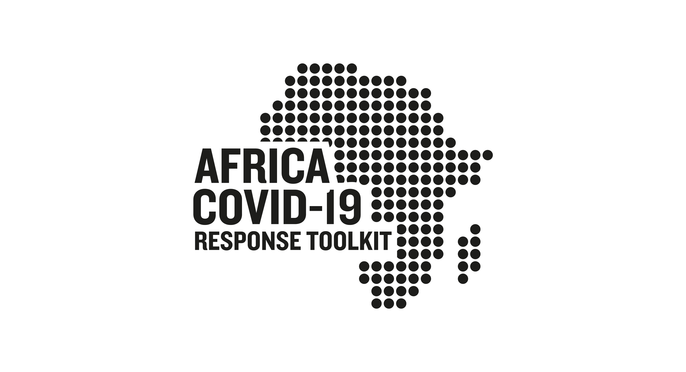

<div align="center">
  
</div>

# Emergency Relief Package Tracker
<!-- ALL-CONTRIBUTORS-BADGE:START - Do not remove or modify this section -->
[](#contributors-)
<!-- ALL-CONTRIBUTORS-BADGE:END -->

> Managing and tracking emergency relief packages across cities, regions, and countries.


## About

This project is designed to help local organizations and government institutions help track distribution of emergency relief packages along with their contents to ensure essential supplies are evenly distributed.

## Getting Started


1. Create a Postgres database and add the PostGIS extension.

2. Make sure you have [NodeJS](https://nodejs.org/) and [npm](https://www.npmjs.com/) installed.
3. Create a `.env` file to include the details for your Postgres instance and database and include the following:

    ```
    PGNAME= <db username>
    PGPASS= <db password>
    PGDB= <db name>
    PGPORT=5432
    ```
4. Install your dependencies

    ```
    cd path/to/emergency-relief-tracker
    npm install
    ```

5. Start your app

    ```
    npm start
    ```

## Testing

Simply run `npm test` and all your tests in the `test/` directory will be run.

## Contributors ✨

Thanks goes to these wonderful people ([emoji key](https://allcontributors.org/docs/en/emoji-key)):

<!-- ALL-CONTRIBUTORS-LIST:START - Do not remove or modify this section -->
<!-- prettier-ignore-start -->
<!-- markdownlint-disable -->
<table>
  <tr>
    <td align="center"><a href="https://deliveraddis.com"><br /><sub><b>Feleg</b></sub></a><br /><a href="https://github.com/africa-covid-19-response-toolkit/emergency-relief-package-tracker/commits?author=dafrica1" title="Code">💻</a></td>
    <td align="center"><a href="https://github.com/naody"><br /><sub><b>Naod Yeheyes</b></sub></a><br /><a href="https://github.com/africa-covid-19-response-toolkit/emergency-relief-package-tracker/commits?author=naody" title="Code">💻</a></td>
  </tr>
</table>

<!-- markdownlint-enable -->
<!-- prettier-ignore-end -->
<!-- ALL-CONTRIBUTORS-LIST:END -->

This project follows the [all-contributors](https://github.com/all-contributors/all-contributors) specification. Contributions of any kind welcome!
